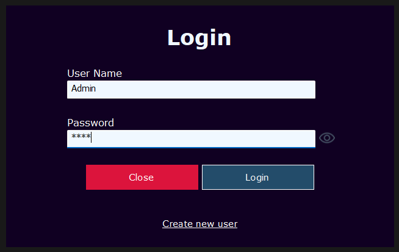
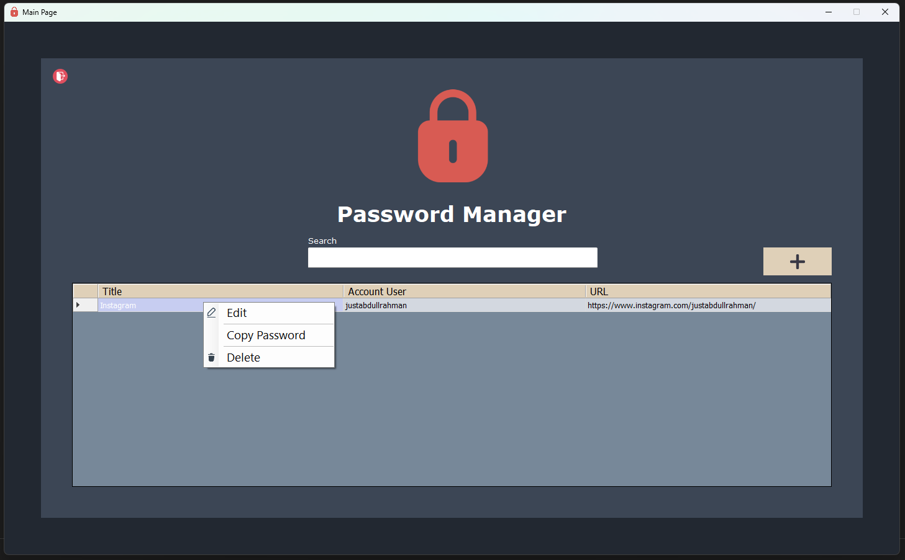
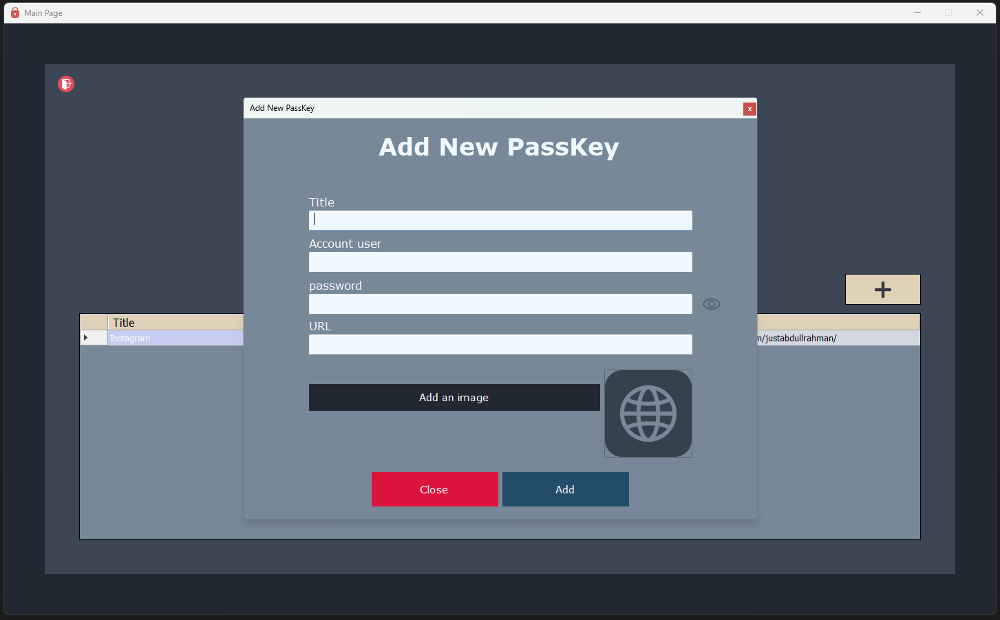

# Password_Manager
# 🛡️ Password Manager System

A desktop application built using **C#** and **Windows Forms** (WinForms). This project is a practical tool designed to securely store and manage your digital credentials, ensuring you have easy access to your login information for any website or service.

---

## 🎯 Project Purpose 
This project was developed as a comprehensive exercise to apply my programming skills. It served as a hands-on challenge to:
* **Security & Privacy:** Explore experimental **Encryption and Decryption** techniques to protect sensitive data.
* **Architecture:** Implement a clean, professional 3-Tier architecture.
* **Practical Utility:** Build a real-world tool that solves the common problem of forgotten passwords.

---

## 🔑 Default Credentials (Quick Access)
If you want to test the application immediately without going through the "Create New User" process, you can use the following default account:
* **Username:** `Admin`
* **Password:** `1234`

---

## ✨ Key Features
* **Multi-User Support:** The system allows multiple users to have their own separate and private accounts on the same application.
* **Smart Clipboard Security:** For enhanced security, when you copy a password, it is available for pasting for **only 20 seconds**. After this period, the clipboard is automatically cleared to prevent unauthorized access.
* **Secure Authentication:** A dedicated login system to ensure only authorized users can access the stored data.
* **Centralized Dashboard:** View all saved accounts, websites, and passwords in a clean, filterable list.
* **Credential Management:** Easily add, update, or delete "Pass Keys" for various services.
* **3-Tier Architecture:** Structured into Data, Business, and Presentation layers for high maintainability.

---

## 📸 User Interface

### 1️⃣ Login Screen

*Figure 1: Login*

### 2️⃣ Main Dashboard

*Figure 2: Main Page*

### 3️⃣ Add New Pass Key

*Figure 3: Add New Pass Key*

---

## 🛠️ Tech Stack
* **Language:** C#
* **Framework:** .NET Framework (WinForms)
* **Database:** SQL Server
* **Security:** Experimental Encryption/Decryption logic & Timer-based clipboard clearing

---

## 🚀 Installation & Setup

1.  **Clone/Download:** Download the project files and extract the archive.
2.  **Database Setup:**
    > **⚠️ IMPORTANT:** The database file is included within the project folder. Please ensure you download and attach it to your **SQL Server Management Studio (SSMS)**
3.  **Connection String:** Update the `ConnectionString` in the `clsDataAccessSettings.cs` file (Data Layer) to match your local SQL Server instance name.
```csharp
// Example:
public static string ConnectionString = "Server=.;Database=DVLD;User Id=YourUser;Password=YourPassword;";
```
4.  **Run:** Open the `.sln` file in **Visual Studio** and press `F5` to build and run.
* **Executable Path:** You can find the ready-to-run application at the following path:  
      `\Password Manager\bin\Debug\Password Manager.exe`
---
**This project represents a significant step in my learning journey, focusing on security and software structure.** 🫡
